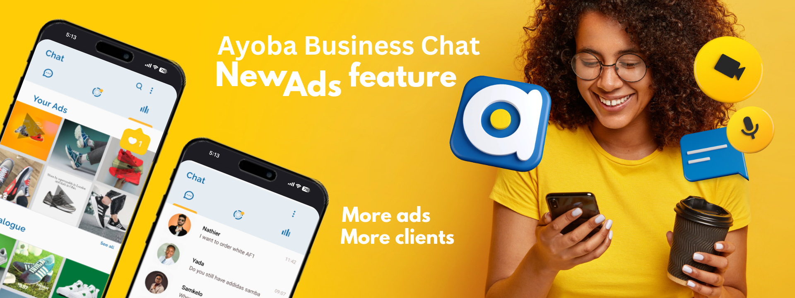

# Welcome to My Figma Design Portfolio! 🚀

Below, you'll find a collection of my various design projects, including UI/UX designs, mobile and web interfaces, and branding concepts. Each project is linked to its corresponding Figma file for easy access.

## 🚀 Projects

### 1. **Ayoba Business Chat UI**
A modern business chat interface designed for the Ayoba platform, enhancing user engagement and marketing capabilities.  
**🔗 [View on Figma](YOUR_FIGMA_LINK_HERE)**

### 2. **FLUF WEBSITE REDESIGN**
A modern and visually captivating redesign of the FLUF website, aimed at improving usability, navigation, and overall aesthetic appeal. The new design introduces a more interactive and engaging user experience with enhanced typography, intuitive layouts, and immersive visuals.

**🔗 [View on Figma](YOUR_FIGMA_LINK_HERE)**

### 3. **Stadium Grid Simulation UI**
An interactive UI concept designed for a stadium simulation project, focusing on user experience and real-time data representation.  
**🔗 [View on Figma](YOUR_FIGMA_LINK_HERE)**

### 4. **Medical IoT Platform UI**
A futuristic interface for a healthcare platform, integrating IoT devices for remote patient monitoring and telemedicine.  
**🔗 [View on Figma](YOUR_FIGMA_LINK_HERE)**

### 5. **Vision Sprint Agency Website**
A visually appealing and user-friendly website design for Vision Sprint, a design agency specializing in branding and UI/UX.  
**🔗 [View on Figma](YOUR_FIGMA_LINK_HERE)**

### 6. **Real Estate Website UI**
A dynamic and interactive real estate platform design that incorporates advanced filtering, property showcases, and a modern aesthetic.  
**🔗 [View on Figma](YOUR_FIGMA_LINK_HERE)**

### 7. **E-Commerce Web Design**
A clean and minimalistic e-commerce website UI, featuring intuitive navigation and a seamless shopping experience.  
**🔗 [View on Figma](YOUR_FIGMA_LINK_HERE)**

## 📌 How to View

1. Click on any project link above.
2. If prompted, log in to your Figma account.
3. Explore the design, including components, prototypes, and interactions.

## 📩 Contact

For collaborations, feedback, or inquiries, feel free to reach out:

- **Email:** [your.email@example.com](mailto:your.email@example.com)
- **LinkedIn:** [Your LinkedIn](YOUR_LINKEDIN_URL)
- **Portfolio:** [Your Website](YOUR_PORTFOLIO_URL)

---

Thank you for visiting my design portfolio! 🚀

